使用说明文档

## 简介

这套系统的设计初衷是做一个通用型更强的、更加适用于实际业务的配置后台系统。

主要的几个设计目标包括：

- 可视化的表单配置生成，无需为单独业务开发专门的配置后台；
- 能够支持实际业务中的多级联动内容的配置，例如，不同年级、科目、产品线、地区下对应内容不同的场景；
- 提供默认值功能，修改公共内容无需在多处进行编辑。

系统主要分为模版、配置条目两部分。模版表单用来定义配置条目表单的结构，配置条目表单是根据模版定义生成的，模版一般由研发根据业务需求确定所需的配置信息后进行配置。配置条目就是实际的配置内容。简单使用情景下，一个配置条目可以对应一个链接。结合筛选项和默认值的进阶使用情景下，可以是指定筛选项下的多个配置条目合并后的信息对应一个链接（见[筛选项和默认值]()）。

## 简单使用

1. 编辑模版
   简单使用可以忽略筛选项
   编辑内容字段
   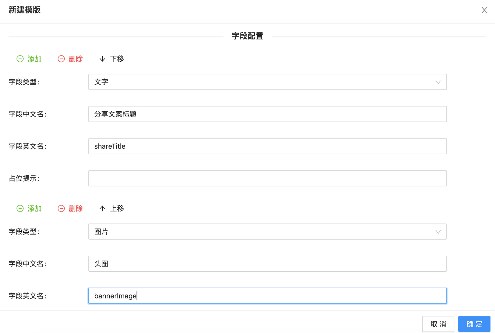
2. 在模版列表中点击刚才创建的模版名称进入配置该模版下的配置条目列表
3. 编辑配置条目
   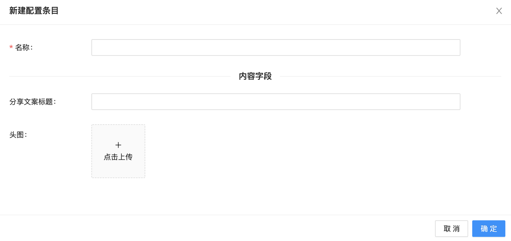
4. 研发通过 id 获取配置条目

## 特性

### 筛选项

业务需求中经常会出现配置内容与年级、科目等班课类型信息的联动。针对这样的场景，我们将一些常用的筛选条件和其他与具体业务相关的配置区分开来，用一组多选框来表示。可以理解为这条系统想要实现的就是一个从筛选条件的组合到配置内容的映射，

具体使用方式：

1. 编辑模版

编辑模版时可以选择在后续编辑配置条目的表单里需要用到哪些配置项，比如配置内容是和年级和科目相关，那么就在这里勾选年级和科目。考虑到有些业务是不关心全部的年级和科目，比如某个需求只关注小学语数外，那就在这里只勾选小学语数外。

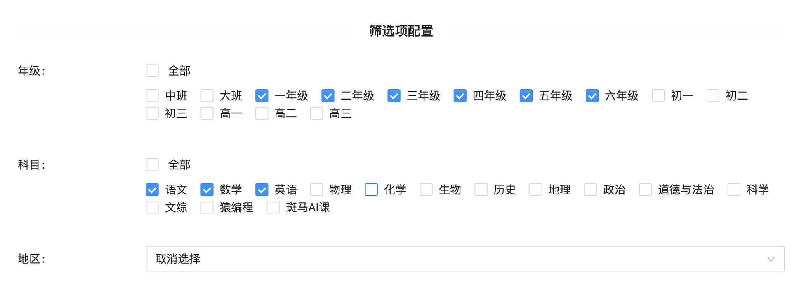

2. 添加配置条目

在第 1 步按照如上图的方式配置模板，配置条目表单中生成的筛选项就是如下图所示。要配置特定年级、科目对应的配置内容，就勾选对应的年级、科目，然后填写下方的内容字段。如果多个年级、科目对应的是同样的内容，这里也可以多选。我们推荐的方式是每个配置条目对应一种筛选条件的组合，不同的筛选条件下配置内容不同就需要创建多个配置条目。

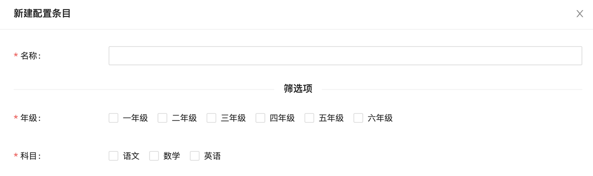

3. 研发根据筛选项获取对应筛选条件下的配置内容

### 默认值

在筛选项的基础上，这套系统实现了填充默认值的功能，做到不同筛选条件下公用的内容字段只需修改一次，而且特殊值能够覆盖默认值，提供了便利性和灵活性。

演示：

例如我们需要配置某个页面的标题和分享文案，在大多数条件下这些字段的内容都是一样的，那么我们首先创建一个配置条目，取名叫默认配置，并勾选全部筛选项。

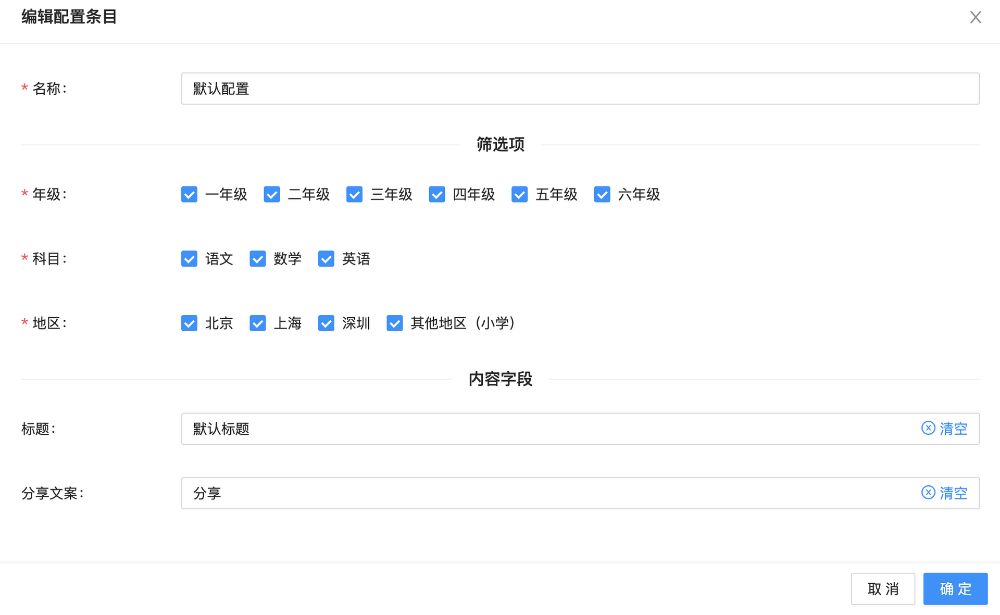

但是在一年级数学的筛选条件下，需要使用一个不同的特殊标题。那么我们新建一个配置条目，勾选一年级数学。

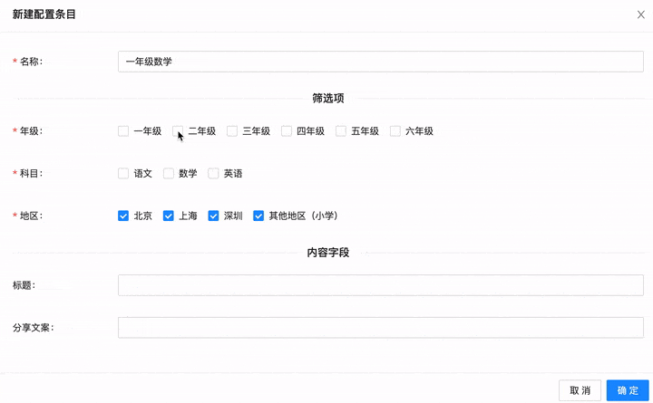

可以看到，当我们每中筛选项都至少勾选一项时，下方的输入框就已经填充了给定条件下的默认值。这时可以修改字段值来覆盖筛选项，如果想要重置到默认值，可以点击输入框右侧的「清空」。

现在配置条目列表中有 2 个项目

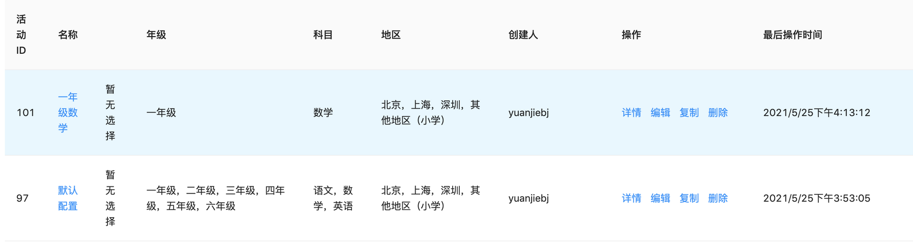

再次点击新建配置条目看下效果

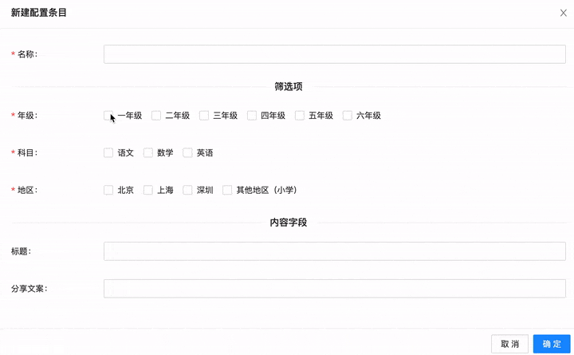

如果现在我们想要修改分享文案字段，那么只需要在「默认配置」这一条中修改。

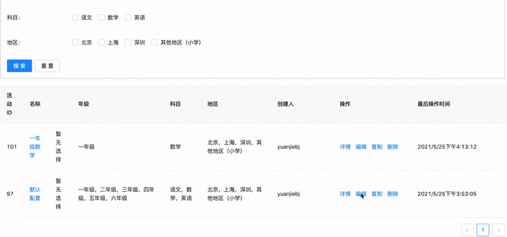

同理，默认值也可以多次覆盖，例如这是我们想为一年级数学北京条件下设定一个特殊标题，只需要在地区中仅勾选北京，然后需改标题的值。

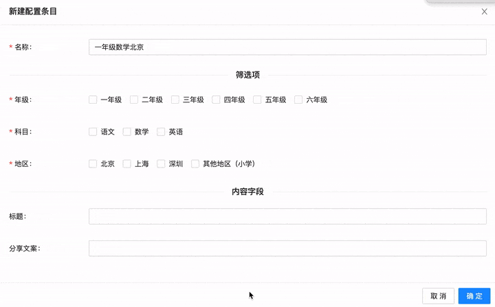

#### 问题

1. 特殊值覆盖默认值的逻辑

目前的实现是按照创建的先后顺序，相同筛选条件下后创建的配置条目的内容字段覆盖县创建的配置条目的对应字段。这就要求先创建筛选项范围更大的配置条目，后创建筛选项范围更细化的配置条目。至于何时创建承载默认值的配置条目，则需要使用者根据实际情况自行把握。需要注意的问题是，**谨慎删除先创建的配置条目**，一旦删除承载默认值的配置条目，会导致依赖这个配置条目的缺失数据。

2. 如何找到默认值是在哪个配置条目里配的？

可以在配置条目列表页上方根据筛选条件搜索相关的配置条目，然后从上往下查找。

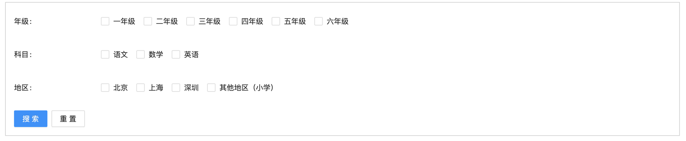
